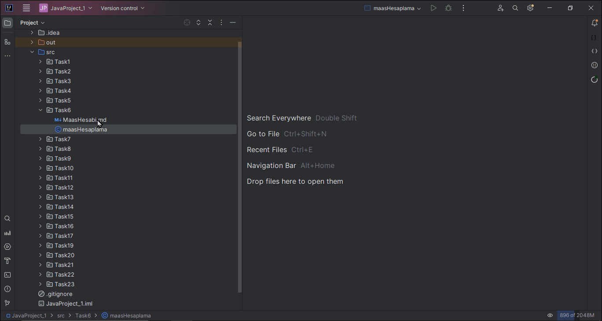

# Satış Elemanı Maaş Hesabı Projesi

Bu proje, bir şirketin satış elemanları için maaş hesaplamasını yapmayı amaçlamaktadır. Şirket politikasına göre, satış elemanına sabit bir maaşın yanı sıra satışlardan elde edilen toplam kazanç ve performansa bağlı olarak bir prim ödenir. Toplam satış tutarı, belirlenen performans düzeyinden fazlaysa daha yüksek (0.10) prim oranı; aksi halde daha düşük (0.05) prim oranı belirlenir. Şirketteki satış elemanının maaşını hesaplamak için bir program geliştirin.

## Program Açıklaması

1. **Kullanıcıdan sabit maaş, satışlardan elde ettiği toplam kazanç ve belirlenen performans seviyesi bilgilerini alın.**
2. **Performans seviyesine göre prim oranını belirleyin.**
3. **Belirlenen prim oranıyla primi hesaplayın.**
4. **Toplam maaşı hesaplayarak kullanıcıya gösterin.**

## Tasarım

1. **Değişkenleri tanımlayın:** toplam_maaş (float), sabit_maaş (float), prim (float), satış_kazancı (float), prim_oranı (float), performans_seviyesi (float)

2. **Kullanıcıdan girdileri alın:** sabit_maaş, satış_kazancı, performans_seviyesi

## Analiz

Toplam maaş, sabit maaş ve performansa bağlı olarak hesaplanmalıdır. Prim, satışlardan elde edilen toplam kazanca bağlı olarak belirlenen performans seviyesine göre değişir.

1. **Performans Seviyesine Göre Prim Oranını Belirle**
```java
// Performans Seviyesine Göre Prim Oranını Belirle
if (satis_kazanci > performans_seviyesi) {
        prim_orani = 0.10;
        } else {
        prim_orani = 0.05;
        }
```
2. **Prim Hesapla**
```java
prim = satis_kazanci * prim_orani;
```
3. **Toplam Maaşı Hesapla** 
```java
toplam_maas = sabit_maas + prim;
```
4. **Toplam Maaşı Yazdır** 




