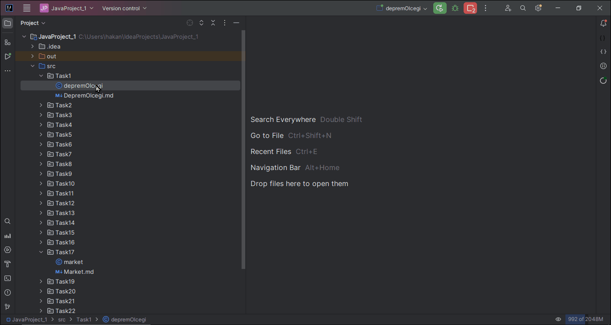

# Deprem Büyüklüğü Tanımlama Projesi

## Amaç
Bu proje, kullanıcıdan alınan deprem büyüklüğüne göre uygun bir tanımlayıcı belirleyen basit bir programın geliştirilmesini amaçlamaktadır.

## Görevler
1. Kullanıcıdan deprem büyüklüğü (magnitude) girişi alınacak.
2. Girilen büyüklük değeri, Richter ölçeğindeki aralıklara göre kontrol edilecek.
3. Belirlenen aralığa uygun tanımlayıcı ekranda gösterilecek.
4. Örneğin, kullanıcı 5.5 girerse, program 5.5 büyüklüğündeki bir depremin orta şiddette bir deprem olarak kabul edildiğini belirtecek.

## Algoritma / Pseudocode 
* Pseudocode bir programın yazılacak kodunun temel algoritmasını daha anlaşılır ve soyut bir düzeyde ifade etmek için yaygın olarak kullanılır. Bu, programlama dilinden bağımsız bir şekilde düşünmeyi ve tasarlamayı kolaylaştırabilir:
1. **Kullanıcıdan deprem büyüklüğü (magnitude) girişi al.**
2. **Eğer büyüklük 2.0'dan azsa:**
    - Yaz "Micro - Mikro"
3. **Eğer büyüklük 2.0 ile 3.0 arasındaysa:**
    - Yaz "Very minor - Çok küçük"
4. **Eğer büyüklük 3.0 ile 4.0 arasındaysa:**
    - Yaz "Minor - Küçük"
5. **Eğer büyüklük 4.0 ile 5.0 arasındaysa:**
    - Yaz "Light - Hafif"
6. **Eğer büyüklük 5.0 ile 6.0 arasındaysa:**
    - Yaz "Moderate - Orta"
7. **Eğer büyüklük 6.0 ile 7.0 arasındaysa:**
    - Yaz "Strong - Ağır"
8. **Eğer büyüklük 7.0 ile 8.0 arasındaysa:**
    - Yaz "Major - Büyük"
9. **Eğer büyüklük 8.0 ile 10.0 arasındaysa:**
    - Yaz "Great - Çok Büyük"
10. **Eğer büyüklük 10.0'dan fazlaysa:**
    - Yaz "Meteoric - Meteorik"
11. **Programı sonlandır.**

## Dikkat Edilmesi Gerekenler
- Program, kullanıcıdan aldığı değeri doğru bir şekilde kontrol etmeli ve uygun tanımlayıcıyı belirlemelidir.
- Pseudocode veya algoritmadaki akıştan faydalanarak, programın temel mantığını uygulayın.
- Proje, basit bir konsol uygulaması olarak geliştirilmelidir.

