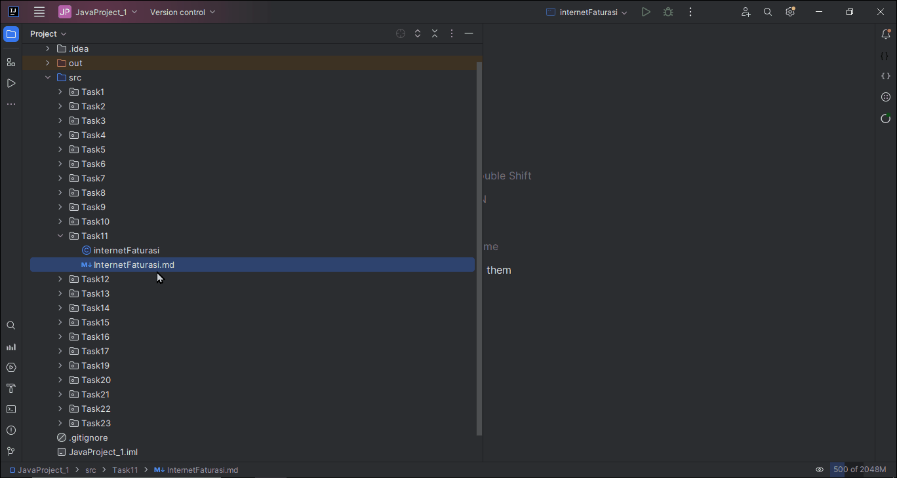

# İnternet Servis Sağlayıcı Fatura Hesaplama Projesi

Bu proje, bir internet servis sağlayıcısının müşterilerinin aylık faturalarını hesaplamak amacıyla geliştirilecektir. Müşterinin faturası, aylık sabit ücret ve kullanıcının fazladan kullandığı internet trafiğinden kaynaklanan ekstra ücret üzerinden hesaplanacaktır. Ekstra ücret, müşterinin ait olduğu kategoriye göre belirlenecektir. Birim fiyatlara ilişkin bilgiler aşağıda verilmiştir. Servis sağlayıcının TÜM müşterilerinin aylık toplam faturasını hesaplamak için bir program geliştirin.

## Problemin Tanımı

- Kategori 1 için ek ücret birim fiyatı: 0.10
- Kategori 2 için ek ücret birim fiyatı: 0.20
- Kategori 3 için ek ücret birim fiyatı: 0.30

## Ana Program

1. **Sürekli tekrar edecek bir döngü oluştur.**
   * 1.1. Aktif müşterinin faturasının hesaplanacağı işlemleri gerçekleştirecek `fatura_hesapla` fonksiyonunu çağır.
   * 1.2. Aktif müşterinin aylık internet faturasını göster.
   * 1.3. Yeni işlem için onay alım işlemlerini gerçekleştirecek `isleme_devam_mi()` fonksiyonunu çağır. Cevaba bağlı olarak döngüye devam et veya sonlandır.

## `fatura_hesapla` Fonksiyonu Tanımlaması

1. **Değişkenleri tanımla:**
    - `aylik_fatura` (float), `aylik_sabit_ucret` (float),
    - `ekstra_ucret` (float), `ek_ucret_birim_fiyati` (float), 
    - `kategori` (integer), `fazla_kullanim_miktari_GB` (integer)
2. **Kullanıcıdan girdileri al:**
    - `aylik_sabit_ucret` (float), `kategori` (integer), `fazla_kullanim_miktari_GB` (integer)
3. **Aylık internet faturasını hesapla:**
   * 3.1. Ekstra ücret birim fiyatını belirle
   * 3.2. Ekstra ücreti hesapla
   * 3.3. Toplam aylık faturayı hesapla
4. **Aylık internet fatura tutarını `return` et.**

