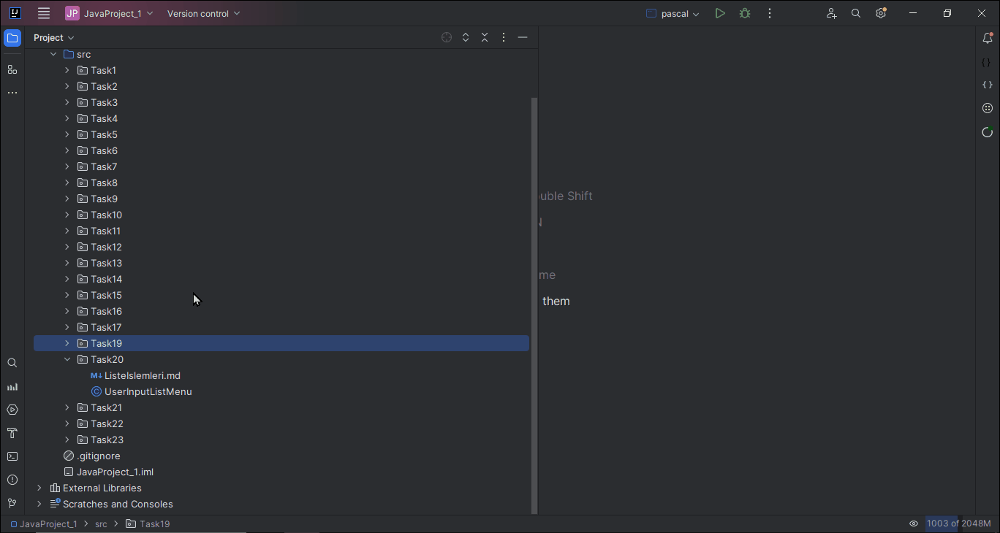

# Liste İşlemleri Projesi

## Özet

Bu projede, kullanıcının girdilerini kullanarak bir liste oluşturmaya ve bu listeyi yönetmeye olanak tanıyan bir Java programı geliştireceksiniz. Program, kullanıcının listeye ekleme, çıkarma, sıralama, ters çevirme, boyutunu alma, belirli bir elemanın sayısını bulma, belirli bir elemanın indekslerini bulma, kopyasını alma, belirli bir elemanı silme ve mevcut elemanları listeleme gibi işlemleri gerçekleştirmesini sağlayacaktır.

## Programın Akışı

Program, kullanıcının girdilerini kullanarak bir liste oluşturur. Ardından, kullanıcının seçtiği işleme göre listeyi yönetir. İşlemler şu şekildedir:

- **_Eleman Ekle:_** Kullanıcı, eklemek istediği elemanı girer. Program, elemanı listeye ekler.
- **_Eleman Kaldır:_** Kullanıcı, kaldırmak istediği elemanı girer. Program, elemanı listeden siler.
- **_En Üst Elemanı Görüntüle:_** Program, listenin en üst index'te bulunan elemanını görüntüler.
- **_Elemanları Sırala:_** Program, listeyi alfabetik olarak sıralar.
- **_Elemanları Ters Çevir:_** Program, listeyi ters çevirir.
- **_Yığındaki Eleman Sayısı:_** Program, listenin eleman sayısını görüntüler.
- **_Belirli Bir Elemanın Sayısı:_** Kullanıcı, sayılmasını istediği elemanı girer. Program, elemanın listeye kaç kez dahil edildiğini görüntüler.
- **_Belirli Bir Elemanın İndeksleri:_** Kullanıcı, indekslerini öğrenmek istediği elemanı girer. Program, elemanın listeye dahil olduğu indeksleri görüntüler.
- **_Yığının Kopyasını Al:_** Program, listenin bir kopyasını oluşturur.
- **_Belirli Bir Aralıktaki Elemanları Filtrele:_** Kullanıcı, başlangıç ve bitiş elemanlarını girer. Program, belirtilen aralıktaki elemanları görüntüler.
- **_Güncel Elemanları Listele:_** Program, listenin mevcut elemanlarını görüntüler.

## Projenin Gerçekleştirilmesi

*Programınızı, aşağıdaki adımlardan takip ederek gerçekleştirebilirsiniz:*

1. Bir `List` nesnesi oluşturun. Bu `List` nesnesi, kullanıcıdan alınan girişleri depolamak için kullanılacaktır.
2. Bir `Scanner` nesnesi oluşturun. Bu `Scanner` nesnesi, kullanıcıdan giriş almak için kullanılacaktır.
3. Bir döngü oluşturun. Bu döngü, kullanıcının `0` değerini girmesi durumunda sonlanacaktır.
4. Döngü içinde, kullanıcıdan bir seçim isteyin. Seçimler, yukarıda listelenen işlemlerden herhangi biri olabilir.
5. Kullanıcıdan gelen seçimi işleyin. Seçime göre, `List` nesnesi üzerinde gerekli işlemleri gerçekleştirin.

Aşağıdaki örnek, başlangıç için yardımcı olabilir:

```java
// [Gerekli import ve temel yapı]

import java.util.*;

public class UserInputListMenu {

    private static List<String> dizi = new ArrayList<>();
    private static Scanner scanner = new Scanner(System.in);

    public static void main(String[] args) {
        boolean exit = false;

        while (!exit) {
            System.out.println("\n--- MENÜ ---");
            System.out.println("1. Eleman Ekle");
            System.out.println("2. En Üst Indexli Elemanı Kaldır");
            System.out.println("3. En Üst Indexli Elemanı Görüntüle");
            System.out.println("4. Elemanları Sırala");
            System.out.println("5. Elemanları Ters Çevir");
            System.out.println("6. Dizidaki Eleman Sayısı");
            System.out.println("7. Belirli Bir Elemanın Sayısı");
            System.out.println("8. Belirli Bir Elemanın İndeksleri");
            System.out.println("9. Dizinin Kopyasını Al");
            System.out.println("10. Belirli Bir Elemanı Kaldır");
            System.out.println("11. Belirli Bir Aralıktaki Elemanları Filtrele");
            System.out.println("12. Güncel Elemanları Listele");
            System.out.println("0. Çıkış");
            System.out.print("Seçiminizi yapın: ");

            int choice = scanner.nextInt();
            scanner.nextLine();  // Boş satırı oku

            switch (choice) {
                case 1:
                    System.out.print("Eklemek istediğiniz elemanı girin: ");
                    dizi.add(scanner.next());
                    break;
                case 2:
                    if (!dizi.isEmpty()) {
                        dizi.remove(dizi.size() - 1);
                        System.out.println("En üst eleman kaldırıldı.");
                    } else {
                        System.out.println("Yığın boş.");
                    }
                    break;
                //  case 3: .........  
                //TODO: Diğer Menü metodları gerçekleştirilecek...
                case 12:
                    listCurrentElements();
                    break;
                case 0:
                    exit = true;
                    System.out.println("Programdan çıkılıyor.");
                    break;
                default:
                    System.out.println("Geçersiz seçim. Lütfen tekrar deneyin.");
                    break;
            }
            listCurrentElements();
        }
    }

    private static void listCurrentElements() {
        System.out.println("Güncel Elemanlar: " + dizi);
    }
}
```

