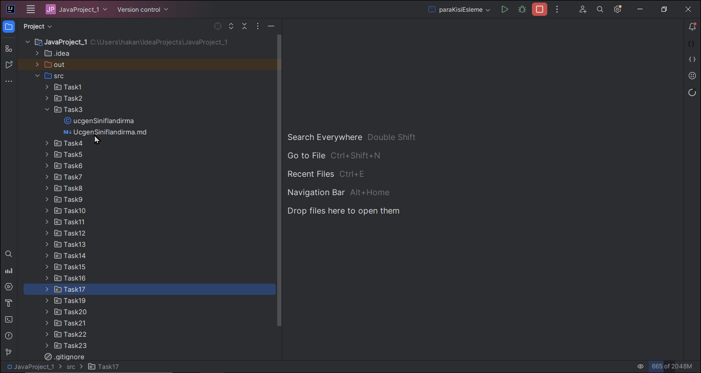

# Üçgen Sınıflandırma Projesi

Bu proje, kullanıcının girdiği üç kenar uzunluğuna göre bir üçgenin türünü belirleyen bir programın geliştirilmesini amaçlamaktadır. Üçgen, kenar uzunluklarına göre eşkenar, ikizkenar veya çeşitkenar olarak sınıflandırılabilir.

## Program Açıklaması

1. **Kullanıcıdan üçgenin ilk kenar uzunluğunu okuyun.**
2. **Kullanıcıdan üçgenin ikinci kenar uzunluğunu okuyun.**
3. **Kullanıcıdan üçgenin üçüncü kenar uzunluğunu okuyun.**
4. **Girilen kenar uzunluklarına göre üçgenin türünü ve geçerliliğini belirleyin.**
5. **Belirlenen üçgen türünü ve geçerlilik durumunu içeren bir mesajı konsolda görüntüleyin.**

## Üçgen Türleri ve Geçerlilik

- **Geçerli Üçgen:** Herhangi bir kenarı, diğer iki kenarın toplamından kısa; farkından da uzundur.
    - **Eşkenar Üçgen:** 3 kenarı da aynı uzunluğa sahiptir.
    - **Ikizkenar Üçgen:** Aynı uzunlukta iki kenarı ve farklı uzunlukta üçüncü bir kenarı vardır.
    - **Çeşitkenar Üçgen:** Tüm kenar uzunlukları farklıdır.
- **Geçersiz Üçgen:** Verilen kenar uzunlukları geçerli bir üçgen oluşturmaz.

Bu program, kullanıcının girdiği üç kenar uzunluklarına göre üçgenin türünü ve geçerliliğini belirleyerek sonucu konsolda göstermektedir. Eğer kullanıcı geçerli bir üçgen tanımazsa veya üçgen belirlenen tür kriterlerine uymazsa, uygun bir hata mesajı gösterilir.

