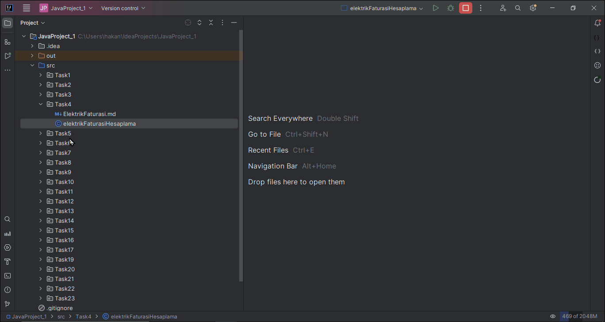

# Elektrik Faturası Hesaplama Projesi

Bu proje, elektrik tedarik şirketinin müşterinin aylık faturasını hesaplayan bir programın geliştirilmesini amaçlamaktadır. Elektrik tüketimi, son okuma ve bir önceki okuma arasındaki farka göre hesaplanacak, birim fiyat ise tüketim aralığına göre belirlenecektir.

## Problem

Elektrik tedarik şirketinin abonelik sözleşmesine göre, müşterinin aylık faturası şu şekilde hesaplanır:

1. **elektrik\_tüketimi** = yeni\_okuma – eski\_okuma
2. **birim\_fiyat'ı**, elektrik tüketimine göre belirlenir.
3. **aylik_fatura = elektrik_tüketimi * birim_fiyat**

| Elektrik Tüketimi | Birim Fiyat |
|-------------------|-------------|
| 0 - 100 kWh       | 1.1         |
| 101 - 200 kWh     | 1.3         |
| 201 - 300 kWh     | 1.5         |
| 301 - 400 kWh     | 1.7         |
| 401 - 500 kWh     | 1.9         |
| 501 kWh ve üstü   | 2.3         |

## Analiz

İlk olarak odaklanmamız gereken müşterinin bir aylık faturasının hesaplanması olmalı. Şirket politikasına göre aylık fatura şu şekilde hesaplanır:

1. **elektrik_tüketimi = yeni_okuma – eski_okuma**
2. **birim_fiyat'ı, elektrik tüketimine göre belirle**
    - Elektrik Tüketimi: 0 - 100 kWh, Birim Fiyat: 1.1
    - Elektrik Tüketimi: 101 - 200 kWh, Birim Fiyat: 1.3
    - Elektrik Tüketimi: 201 - 300 kWh, Birim Fiyat: 1.5
    - Elektrik Tüketimi: 301 - 400 kWh, Birim Fiyat: 1.7
    - Elektrik Tüketimi: 401 - 500 kWh, Birim Fiyat: 1.9
    - Elektrik Tüketimi: 501 kWh ve üstü, kWh, Birim Fiyat: 2.3
3. **Aylık fatura hesaplanır - Analiz - 1.**
    - aylik_fatura = elektrik_tüketimi * birim_fiyat

## Tasarım

Değişkenleri tanımlayın:
- **aylik_fatura (float)**
- **elektrik_tüketimi (integer)**
- **birim_fiyat (float)**
- **yeni_okuma (integer)**
- **eski_okuma (integer)**

Kullanıcıdan girdileri alın:
- **yeni_okuma (integer)**
- **eski_okuma (integer)**

Aylık faturayı hesapla:
- Elektrik tüketimini hesaplayın:
    - **elektrik_tüketimi = yeni_okuma – eski_okuma**
- Birim fiyatı, elektrik tüketimine göre belirle - Analiz - 1.2.
    - Elektrik Tüketimi: 0 - 100 kWh, Birim Fiyat: 1.1
    - Elektrik Tüketimi: 101 - 200 kWh, Birim Fiyat: 1.3
    - Elektrik Tüketimi: 201 - 300 kWh, Birim Fiyat: 1.5
    - Elektrik Tüketimi: 301 - 400 kWh, Birim Fiyat: 1.7
    - Elektrik Tüketimi: 401 - 500 kWh, Birim Fiyat: 1.9
    - Elektrik Tüketimi: 501 kWh ve üstü, kWh, Birim Fiyat: 2.3
- Aylık faturayı hesaplayın:
    - **aylik_fatura = elektrik_tüketimi * birim_fiyat**

Aylık elektrik faturasını göster.

