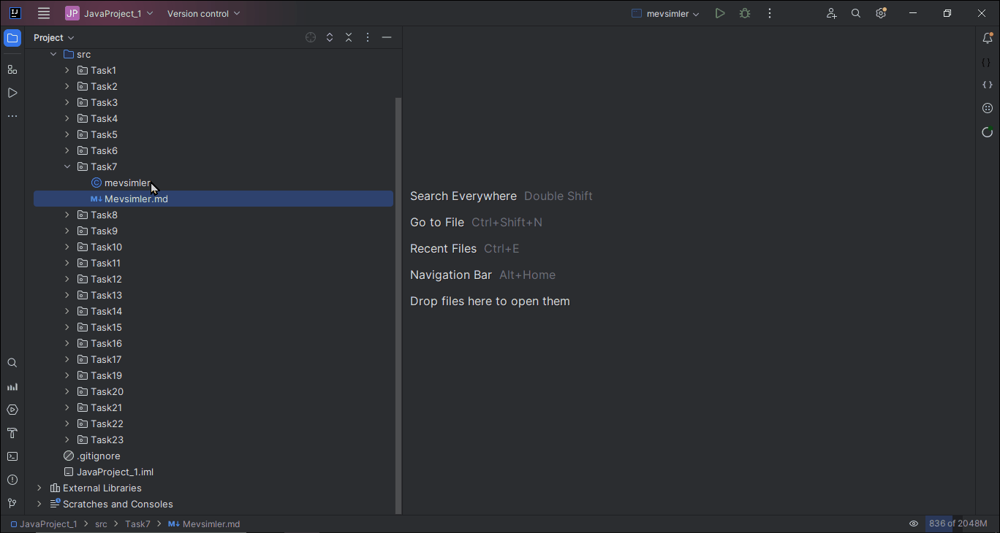

# Mevsim Belirleme Programı

Yıl dört mevsime ayrılmıştır: ilkbahar, yaz, sonbahar ve kış. Kullanıcının girdiği ay ve güne göre içinde bulunulan mevsimi gösteren programı geliştirin. Mevsimlerin değiştiği tarih aralıkları takvimin kuzey yarım küre için genel olarak kabul edilen verilere dayanmaktadır.

## Program Açıklaması

1. **Kullanıcıdan ay ve gün bilgilerini alın.**
2. **Belirlenen tarih aralıklarına göre içinde bulunulan mevsimi belirleyin.**
3. **Sonucu kullanıcıya gösterin.**

## Analiz

Mevsimlerin değiştiği kesin tarihler şu şekilde kabul edilmelidir:

- **İlkbahar:**
    - İlk günü: 20 Mart
    - Nisan, Mayıs
    - 20 Haziran'a kadar devam eder.

- **Yaz:**
    - İlk günü: 21 Haziran
    - Temmuz, Ağustos
    - 21 Eylül'e kadar devam eder.

- **Sonbahar:**
    - İlk günü: 22 Eylül
    - Ekim, Kasım
    - 20 Aralık'a kadar devam eder.

- **Kış:**
    - İlk günü: 21 Aralık
    - Ocak, Şubat
    - 19 Mart'a kadar devam eder.

## Tasarım

1. **Kullanıcıdan Ay ve Gün Bilgilerini Al:**

2. **Belirlenen Tarih Aralıklarına Göre Mevsimi Belirle:**
    - İlkbahar için:
        - Eğer ay Nisan veya Mayıs ise İlkbahar.
        - Eğer ay Mart ise ve gün 20'den büyükse (dahil) İlkbahar.
        - Eğer ay Haziran ise ve gün 20'den küçükse (dahil) İlkbahar.

    - Yaz için:
        - Eğer ay Temmuz veya Ağustos ise Yaz.
        - Eğer ay Eylül ise ve gün 21'den küçükse (dahil) Yaz.
        - Eğer ay Haziran ise ve gün 21'den büyükse (dahil) Yaz.

    - Sonbahar için:
        - Eğer ay Ekim veya Kasım ise Sonbahar.
        - Eğer ay Eylül ise ve gün 21'den büyükse Sonbahar.
        - Eğer ay Aralık ise ve gün 20'den küçükse (dahil) Sonbahar.

    - Kış için:
        - Eğer ay Ocak veya Şubat ise Kış.
        - Eğer ay Aralık ise ve gün 20'den büyükse Kış.
        - Eğer ay Mart ise ve gün 19'dan küçükse (dahil) Kış.

3. **Mevsimi Kullanıcıya Bildir:**

