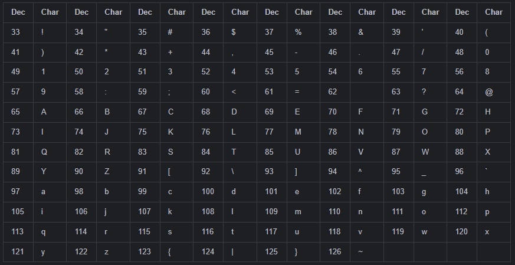

# Rastgele Parola Üretme Programı

Bu program, rastgele bir parola üreten bir işlev içermelidir. Parola, 8 ile 10 karakter arasında rastgele bir uzunluğa sahip olmalıdır. Her karakter, ASCII tablosundaki 33 ila 126. konumlardan rastgele seçilmelidir. Program, rastgele oluşturulan parolayı tek sonuç olarak döndürür ve bu parolayı ana programda görüntüler.

## Program Açıklaması

1. **Rastgele Parola Üretme İşlevi:**
    - İşlev, herhangi bir parametre almayacak şekilde tasarlanır.
    - Parola uzunluğunu 7 ile 10 karakter arasında rastgele seçer.
    - Her karakteri ASCII tablosundaki 33 ila 126. konumlardan rastgele seçer ve parolayı oluşturur.
    - Oluşturulan parolayı tek sonuç olarak döndürür.

2. **Ana Program:**
    - İşlevi çağırarak rastgele parolayı alın.
    - Elde edilen parolayı ekrana yazdırın.

## Tasarım İpuçları

- Java'da rastgele sayı üretmek için `java.util.Random` sınıfını kullanabilirsiniz.
- Parolayı oluştururken bir döngü kullanarak her karakteri belirlenen ASCII aralığından seçebilirsiniz.

- 

